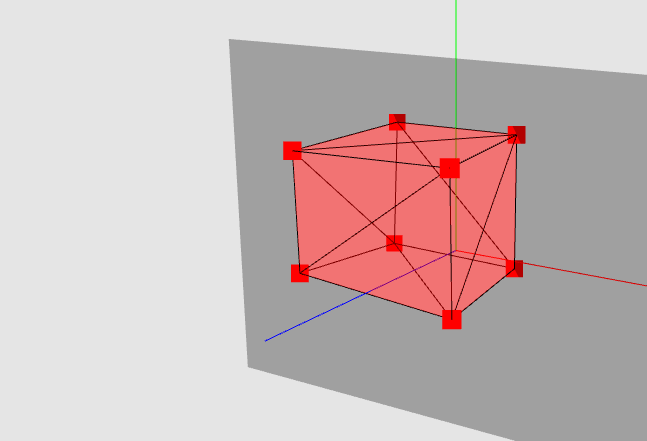
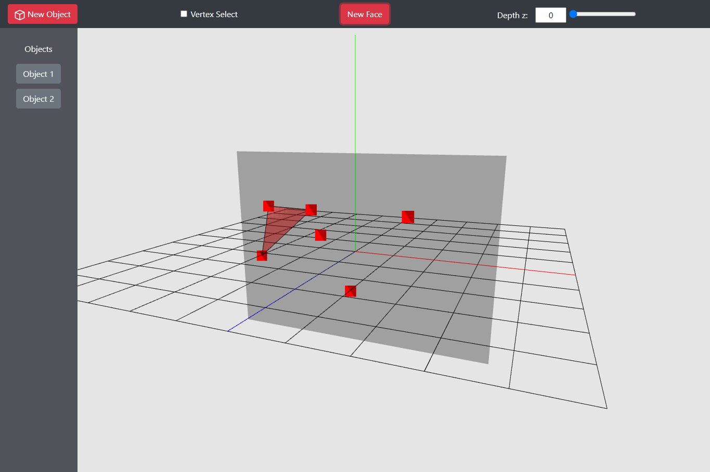

# Trokut

Create and manipulate 3d objects in the web. Useful for visualization of tranformations.

# Specifications

- Three.js Version: 110

    - Get it from https://cdnjs.cloudflare.com/ajax/libs/three.js/110/three.min.js

    - `MathUtils.js` from https://github.com/mrdoob/three.js/blob/master/src/math/MathUtils.js

## Current State

## To Do

- try to use vertex shader of webgl for matrix multiplications: https://threejs.org/docs/#api/en/renderers/webgl/WebGLProgram 